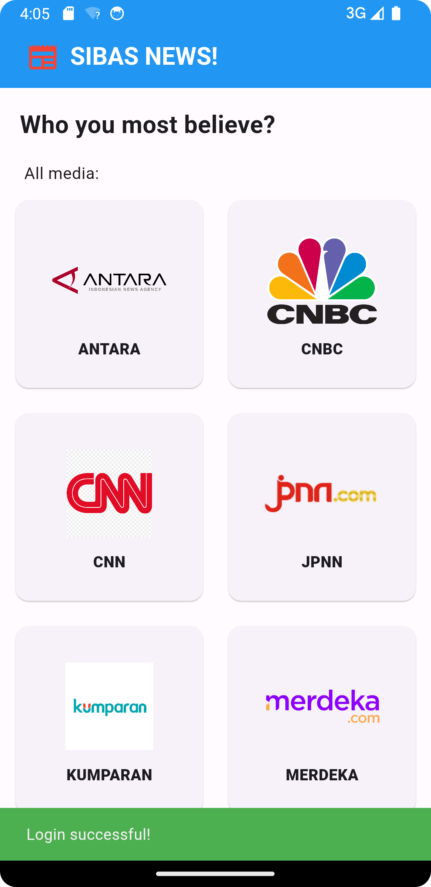
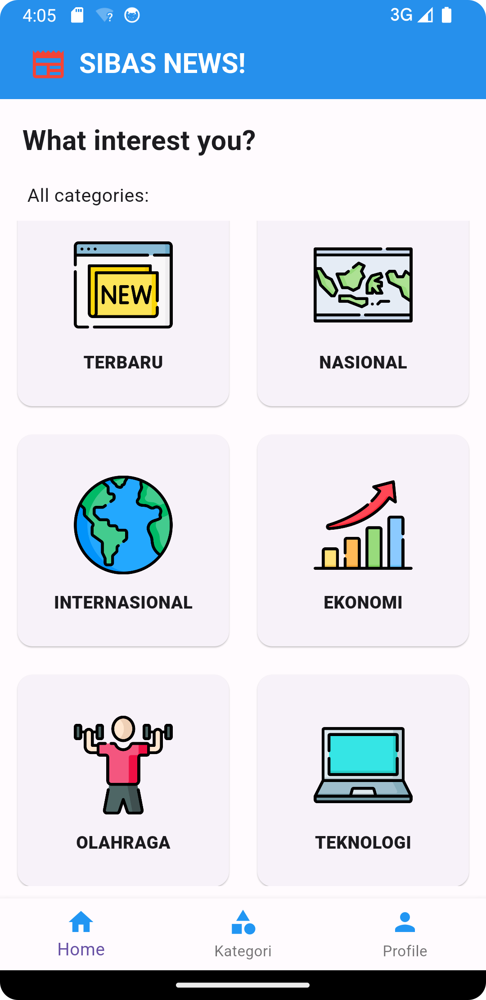
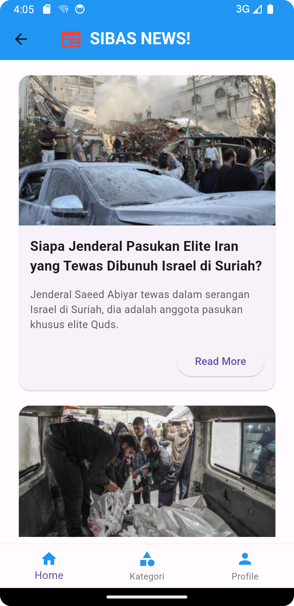
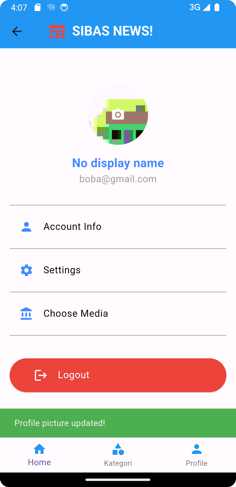
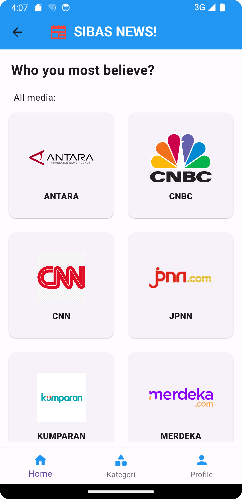

# Project Aplikasi Mobile Flutter
---
## Praktikum Teknologi dan Pemrograman Mobile IF-E


## Author

- Daniel Hasiando Sinaga `(123210047)`
- Vincentius Batista Rahma Bujana `(123210179)`

---

# SIBAS News App

SIBAS News adalah aplikasi berita mobile berbasis Flutter yang memungkinkan pengguna untuk membaca berita dari berbagai kategori. Aplikasi ini menggunakan Firebase untuk otentikasi dan penyimpanan gambar profil, Hive untuk penyimpanan data lokal, dan berbagai paket Flutter untuk menampilkan berita dalam aplikasi.

## Fitur

- Registrasi dan Login menggunakan Firebase Authentication.
- Menampilkan berita dari berbagai kategori.
- Menyimpan preferensi pengguna menggunakan Hive.
- Menampilkan detail berita dalam WebView.
- Mengunggah dan memperbarui foto profil pengguna menggunakan Firebase Storage.

## Instalasi

1. Clone repository ini:

   ```sh
   git clone https://github.com/pesuts/news-app-mobile
   ```

2. Masuk ke direktori proyek:

   ```sh
   cd project_praktikum
   ```

3. Instal dependensi:

   ```sh
   flutter pub get
   ```

4. Konfigurasi Firebase:

   - Buat proyek baru di [Firebase Console](https://console.firebase.google.com/).
   - Tambahkan aplikasi Android dan iOS ke proyek Firebase.
   - Unduh file `google-services.json` (untuk Android) dan `GoogleService-Info.plist` (untuk iOS) dan tempatkan di direktori yang sesuai.
   - Ikuti petunjuk di Firebase Console untuk menambahkan Firebase ke aplikasi Flutter Anda.
   - Ganti file `firebase_options.dart` dengan konfigurasi Firebase Anda sendiri menggunakan perintah `flutterfire configure`.

5. Jalankan aplikasi:

   ```sh
   flutter run
   ```

## Struktur Proyek

- `lib/`
  - `api/`
    - `ApiConfig.dart`: Konfigurasi dasar API.
    - `ApiRoute.dart`: Definisi rute API untuk mengambil kategori dan berita.
  - `model/`
    - `ApiCategoryModel.dart`: Model data untuk kategori API.
    - `ApiModel.dart`: Model data untuk API umum.
    - `CategoryModel.dart`: Model data untuk kategori berita.
    - `MediaModel.dart`: Model data untuk media.
    - `NewsModel.dart`: Model data untuk berita.
  - `views/`
    - `auth/`
      - `Login.dart`: Halaman login.
      - `Register.dart`: Halaman registrasi.
    - `HomeNews.dart`: Halaman utama berita.
    - `DetailNews.dart`: Halaman detail berita.
    - `ProfilePage.dart`: Halaman profil pengguna.
    - `MediaCategories.dart`: Halaman kategori media.
    - `MediaCategoriesHome.dart`: Halaman kategori media di beranda.
    - `NewsCategories.dart`: Halaman kategori berita.
  - `BottomNavBar.dart`: Widget untuk navigasi bawah.

## Konfigurasi Firebase

- `firebase_options.dart`: File ini berisi konfigurasi Firebase untuk aplikasi ini. Pastikan untuk mengganti dengan konfigurasi proyek Firebasenya.

## Dependensi

Berikut adalah daftar dependensi yang digunakan dalam proyek ini:

- `cupertino_icons`: ^1.0.6
- `url_launcher`: ^6.2.5
- `http`: ^1.2.1
- `webview_flutter`: ^3.0.4
- `firebase_core`: ^2.4.1
- `firebase_auth`: ^4.2.6
- `hive_flutter`: ^1.1.0
- `firebase_storage`: ^11.0.16
- `image_picker`: ^0.8.7+3
- `flutter_lints`: ^3.0.0
- `hive_generator`: ^1.1.3
- `build_runner`: ^2.1.11

## Assets

Daftar asset yang digunakan dalam proyek ini:

- `assets/images/`
- `assets/images/bola.png`

## Penggunaan

### Registrasi dan Login

1. Pengguna dapat mendaftar dengan email dan kata sandi melalui halaman registrasi.
2. Setelah berhasil mendaftar, pengguna akan diarahkan ke halaman login.
3. Pengguna dapat masuk dengan email dan kata sandi yang telah didaftarkan.

### Menampilkan Berita

1. Setelah login, pengguna akan melihat halaman utama dengan daftar berita.
2. Pengguna dapat memilih kategori berita untuk melihat berita sesuai dengan kategori yang dipilih.
3. Pengguna dapat melihat detail berita dengan mengetuk berita yang diinginkan.

### Mengelola Profil

1. Pengguna dapat melihat dan memperbarui foto profil di halaman profil.
2. Pengguna dapat logout dari aplikasi melalui halaman profil.


## Screenshots (Demo)











